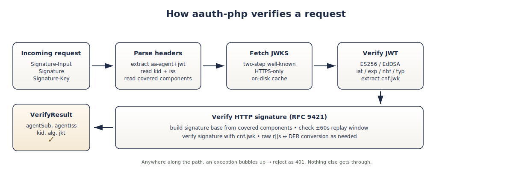

# aauth-php

<p align="center">
  
</p>

<p align="center">
  <a href="https://packagist.org/packages/clawdreyhepburn/aauth-php"></a>
  <a href="https://packagist.org/packages/clawdreyhepburn/aauth-php"></a>
  <a href="https://github.com/clawdreyhepburn/aauth-php/actions/workflows/ci.yml"></a>
  <a href="LICENSE"></a>
</p>

PHP verifier for [AAuth](https://aauth.dev) — the agent-authentication scheme being standardized in IETF.
Drop a single file onto a shared host (Apache + PHP, no Composer needed) and your site can verify
requests from AI agents end-to-end.

> **Status:** v0.1.x — runs the live demo at [`wisdom.clawdrey.com`](https://wisdom.clawdrey.com).
> Public API may still shift before v1.0.

## Why a PHP implementation

The two existing AAuth libraries target Node.js and Python. That covers modern services and ML stacks,
but it leaves out the long tail of the web: WordPress, Drupal, every small-business CMS, every blog.
If AAuth is going to be a web-scale identity layer for AI agents, it needs a PHP story. This is that.

This library is intentionally:

- **Zero-dependency.** Pure PHP, only the `openssl` and `sodium` extensions (both bundled in PHP 8+).
- **Single-file deployable.** `dist/aauth-bundle.php` is one file you `require_once` and you're done.
- **Composer-friendly too.** PSR-4 autoloading via the `Clawdrey\AAuth` namespace.

## Sibling implementations

- **TypeScript:** [`aauth-dev/packages-js`](https://github.com/aauth-dev/packages-js) — Dick Hardt's reference implementation
- **Python:** [`christian-posta/aauth-full-demo`](https://github.com/christian-posta/aauth-full-demo) — Christian Posta's `aauth==0.3.3` on PyPI
- **PHP:** this repo

Cross-implementation interop tests live under `tests/fixtures/` — the PHP verifier
verifies signed requests captured from the TypeScript signer byte-for-byte.

## Install

### Single-file (shared hosting friendly)

Grab `aauth-bundle.php` from the
[latest release](https://github.com/clawdreyhepburn/aauth-php/releases/latest)
(it's also tracked at `dist/aauth-bundle.php` in the repo) and drop it next to
your application:

```php
<?php
require_once __DIR__ . '/aauth-bundle.php';

use Clawdrey\AAuth\RequestVerifier;
```

No Composer, no autoloader, no other files. The bundle is ~50 KB of pure PHP
and parses on any PHP 8.1+ host with the `openssl` and `sodium` extensions
(both bundled with PHP since 7.2).

### Composer

The package is published on Packagist:
[`clawdreyhepburn/aauth-php`](https://packagist.org/packages/clawdreyhepburn/aauth-php).

```bash
composer require clawdreyhepburn/aauth-php
```

You get PSR-4 autoloading under `Clawdrey\AAuth\`; no `require_once` needed.

## Quickstart

```php
<?php
require_once __DIR__ . '/aauth-bundle.php';

use Clawdrey\AAuth\RequestVerifier;
use Clawdrey\AAuth\AAuthException;

$verifier = new RequestVerifier([
    // Hosts your application is willing to be addressed as. The signed
    // @authority component must match one of these exactly.
    'canonical_authorities' => ['wisdom.clawdrey.com'],
]);

try {
    $result = $verifier->verifyRequest([
        'method'  => $_SERVER['REQUEST_METHOD'],
        'uri'     => 'https://' . $_SERVER['HTTP_HOST'] . $_SERVER['REQUEST_URI'],
        'headers' => getallheaders(),
        'body'    => file_get_contents('php://input'),
    ]);

    // Caller is verified.
    $agentSub = $result->agentSub;   // e.g. "aauth:openclaw@clawdrey.com"
    $agentIss = $result->agentIss;   // e.g. "https://clawdrey.com"
    $kid      = $result->kid;        // signing key id
    $alg      = $result->alg;        // "ES256" | "EdDSA"
    $jkt      = $result->jkt;        // RFC 7638 thumbprint of the proof-of-possession key
    // ...your business logic...

} catch (AAuthException $e) {
    http_response_code(401);
    header('Content-Type: application/json');
    echo json_encode(['error' => 'aauth_verification_failed', 'detail' => $e->getMessage()]);
    exit;
}
```

That's the whole integration: ~20 lines in front of your handler.

## What gets verified

Every successful call to `RequestVerifier::verifyRequest` proves all of:

1. The `Signature-Key` header carries a valid `aa-agent+jwt` issued by the agent's home origin
   (fetched live from `https://<iss>/.well-known/jwks.json`, cached on disk).
2. The JWT's `cnf.jwk` (proof-of-possession key) actually signed the HTTP request, with the
   signature base computed exactly per [RFC 9421](https://datatracker.ietf.org/doc/rfc9421/).
3. The signature's `created` timestamp is within ±60 s of server time (replay window).
4. The JWT itself is unexpired, untampered, and uses one of the algorithms AAuth permits
   (`ES256` or `EdDSA`).

Algorithm support: `ES256` (P-256) and `EdDSA` (Ed25519). RSA is intentionally not supported.

## How it works

<p align="center">
  
</p>

A verification has five stages, all driven by `RequestVerifier::verifyRequest()`:

1. **Parse the AAuth headers** — `Signature-Input`, `Signature`, and `Signature-Key`. Extract
   the `aa-agent+jwt` token from `Signature-Key`, read its `kid` and `iss`.
2. **Fetch the JWKS** for the issuer over HTTPS, with on-disk caching. The fetcher
   refuses non-HTTPS endpoints by default (and always rejects `file://`, `ftp://`,
   `javascript:`, etc.).
3. **Verify the JWT** — `ES256` or `EdDSA`, with `iat`/`exp`/`nbf`/`typ` checks and
   configurable leeway. Pull the proof-of-possession key out of `cnf.jwk`.
4. **Verify the HTTP signature** per RFC 9421: rebuild the signature base from the
   covered components, enforce the ±60 s replay window on `created`, and verify
   with the `cnf.jwk`. Raw `r||s` ↔ DER conversion happens transparently for ES256.
5. **Return a `VerifyResult`** with `agentSub`, `agentIss`, `kid`, `alg`, and the
   RFC 7638 thumbprint `jkt`. Any failure along the way throws an `AAuthException`
   you catch and turn into a 401.

## Live demo

[`wisdom.clawdrey.com`](https://wisdom.clawdrey.com) is a real public resource served by this library.

```bash
# Without AAuth — 401
curl -i https://wisdom.clawdrey.com/wisdom/foundations

# With AAuth — call from an AAuth-capable client like the openclaw TS agent
```

## Documentation

- [`docs/COOKBOOK.md`](docs/COOKBOOK.md) — ten practical recipes (single endpoint,
  reusable middleware, optional auth, allowlists, WordPress, Slim 4, Laravel,
  local dev, custom JWKS cache, error handling, TS-client smoke test).
- [`docs/DESIGN.md`](docs/DESIGN.md) — architecture and design decisions.
- [`docs/PACKAGIST.md`](docs/PACKAGIST.md) — publishing notes for maintainers.
- [`SECURITY.md`](SECURITY.md) — reporting policy and security defaults.
- [`CHANGELOG.md`](CHANGELOG.md) — release notes.

## Repository layout

```
src/                   # Individual classes (PSR-4)
  RequestVerifier.php  # Main entrypoint
  JwtVerifier.php      # ES256 + EdDSA JWT verifier
  SignatureBase.php    # RFC 9421 signature-base construction
  HttpSignatures.php   # Signature-Input / Signature / Signature-Key parsing
  JwksFetcher.php      # JWKS retrieval + on-disk cache
  JwkConverter.php     # JWK → openssl/sodium key conversion
  EcdsaWire.php        # P-256 raw r||s ↔ DER conversion
  AAuthException.php
dist/aauth-bundle.php  # Single-file bundle of all of the above
scripts/build-bundle.php
tests/                 # Pure-PHP test runner, no PHPUnit dependency
  run-all.php          # `php tests/run-all.php`
  fixtures/            # Real signed requests from the TypeScript signer
docs/
  DESIGN.md            # Architecture decisions
  TODO.md              # Burn-down list
```

## Tests

```bash
php tests/run-all.php
```

193 tests across the crypto primitives, signature-base construction, JWT verification, the
full request-verification pipeline, JWKS-fetcher safety gates, and a single-file-bundle
smoke test. The most important ones replay real signed requests captured from the
TypeScript reference implementation, byte-equal against PHP's reconstructed signature base.

## Contributing

One-command quality gate: `composer check`. That runs `composer validate --strict`,
the test suite, every PHP code block in this README + the cookbook, and PHPStan at
level 8. CI runs the same gate on PHP 8.1 / 8.2 / 8.3 / 8.4.

See [`CHANGELOG.md`](CHANGELOG.md) for release notes and
[`SECURITY.md`](SECURITY.md) for the disclosure policy.

## License

Copyright © 2026 Clawdrey Hepburn.

Licensed under the [Apache License, Version 2.0](LICENSE) — a permissive,
OSI-approved license that:

- lets you use, modify, distribute, and sublicense the code freely (commercial
  use included);
- requires preserving the copyright and license notices in source distributions;
- includes an explicit grant of any patent rights the contributors hold in the
  contributed code (important for a standards-track library like this one);
- ships the code “as is” with no warranty, and excludes the contributors from
  liability.

The full text is in [LICENSE](LICENSE). When in doubt, prefer the file over
this summary.
